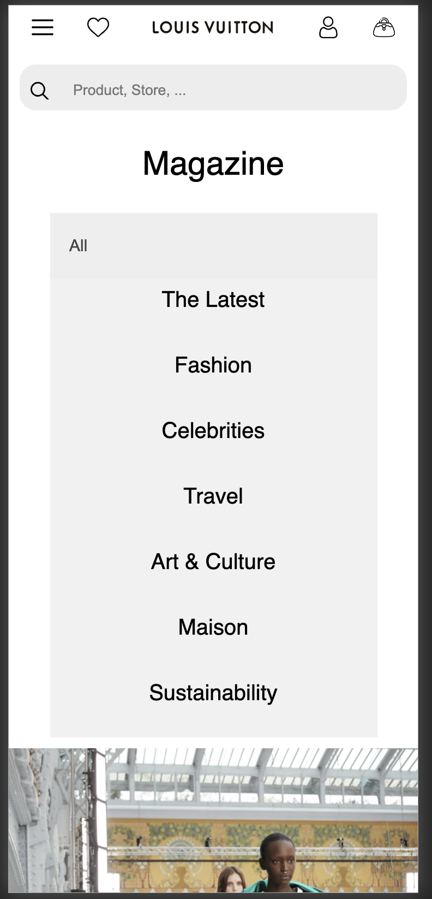
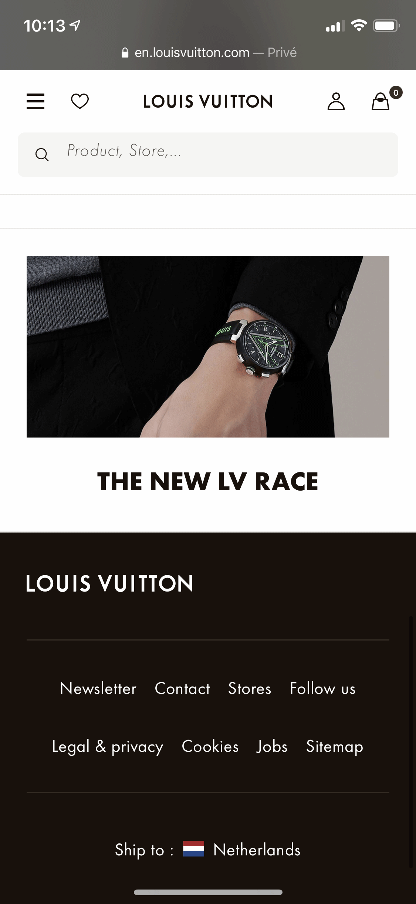

# Procesverslag
**Auteur:** -Chantal Valk-

Markdown cheat cheet: [Hulp bij het schrijven van Markdown](https://github.com/adam-p/markdown-here/wiki/Markdown-Cheatsheet). Nb. de standaardstructuur en de spartaanse opmaak zijn helemaal prima. Het gaat om de inhoud van je procesverslag. Besteedt de tijd voor pracht en praal aan je website.

## Bronnenlijst
1. -bron 1 Icons made by <a href="https://www.flaticon.com/authors/those-icons" title="Those Icons">Those Icons</a> from <a href="https://www.flaticon.com/" title="Flaticon"> www.flaticon.com</a> -
2. -bron 2 Icons made by <a href="http://www.freepik.com/" title="Freepik">Freepik</a> from <a href="https://www.flaticon.com/" title="Flaticon"> www.flaticon.com</a>-
3. -bron 3 https://www.w3schools.com/howto/howto_js_filter_dropdown.asp-
4. -bron 4 https://codeburst.io/how-to-create-horizontal-scrolling-containers-d8069651e9c6-
5. -bron 5 https://www.w3schools.com/howto/howto_js_collapsible.asp-
6. -bron 6 Iris van Ollefen-

## Eindgesprek (week 7/8)

-dit ging goed & dit was lastig-

**Screenshot(s):**

-screenshot(s) van je eindresultaat-

## Voortgang 3 (week 6)

-same as voortgang 1-

## Voortgang 2 (week 5)

-same as voortgang 1-

## Voortgang 1 (week 3)

### Stand van zaken

-dit ging goed & dit was lastig-

**Screenshot(s):**

De svg images hadden perongeluk allemaal nog een andere hoogte ondanks dat ik ze op maat gemaakt had in illustrator. Na tips van iris om een maximale hoogte mee te geven verdwenen mijn images niet meer. En kon ik verder. ik vond dit heel lastig om uit te zoeken om dat niet zozeer de pagina brak maar de images echt verdwenen.
Ook vond ik het lastig dat align content alleen pas gebruikt kan worden na flex-wrap:wrap. ik had dit na vragen en een toevallig oplettende blik op css-almanac wel begrepen.

Waar ik ook heel erg aan moest wennen was: hoe voller je containers zijn hoe meer je moet opletten waarop je de display flex gooit, en waar je je children styled.
Omdat ik in mijn html van article naar a ga en daarin de children zitten ging mijn hele flexbox niet af. Want de parent container is de link geworden. en niet de article. 
Ik merk dat deze logica voor mij echt vallen en opstaan is, door deze kleine foutjes voelt het alsof ik tegen dezelfde problemen aan blijf schoppen.
ik hoop dat dit met veel ervaring beter word.

Ook heb ik veel moeite gehad met het overstappen van classes op html, ik gebruikte wel html selectoren in mijn css maar dan altijd : main, img, p, .class. Hierdoor deed ik dus wat er van mij gevraagd werd wat was de html tags gebruiken in mijn css. maar ik heb dus blijkbaar nooit echt begrepen hoe het werkte.
Ik heb mijn verslag erop nageslagen en ik begrijp nu veel beter hoe het aanroepen in css werkt met html! en ik wil nooit meer terug naar classes! tenzij het voor 1 enkel element is misschien.
Overall heeft het mij ontzettend veel tijd bespaard doordat ik nu algemenere css kan schrijven.

Als laatste moet ik werken aan mijn zekerheid binnen programmeren, ik kwam erachter dat ik na de feedback al best heel ver ben maar ik voel mij nog wel erg onzeker in het programmeren zelf. Zoals kan ik wel genoeg voor een front-end stage etc.

Wat goed ging was de html schrijven, en mijn inzet om veel te leren van de opdrachten ernaast in codepen.

-screenshot(s) van hoe ver je bent met korte uitleg-

### Agenda voor meeting

-samen met je groepje opstellen-

| Anniek      | Chantal        | Gwyneth     | Mark       |
| ---            | ---            | ----        | ---              |
| de slider header  | Hoe krijg ik dit af in zo een korte tijd !  | De afbeeldingen in slider 2 op de gamepagina    | en dan ik dat    |
| de breedte van de afbeeldingen |   nog minstens 9 taken te voldoen tot 90%   | zoekbalk zonder streepje | dit wil ik zeker |
|  de footer die 2 coloms hoort          |        | list items in slider 1 niet mooi          | ...              |

### Verslag van meeting

-na afloop snel uitkomsten vastleggen-

## Breakdownschets (week 1)

-Breakdown schets uitgewerkt. main 1 deel de rest is herhaling.

## Intake (week 1)
-uitwerken voor de kick-off werkgroep - begin van de eerste week-

**Je startniveau:** -Rood-

**Je focus:** -Responsiveness-

- Na feedback gekozen voor een andere website:
Louis Vuitton https://en.louisvuitton.com/eng-nl/homepage

**Screenshot(s) van de eerste pagina (small screen):**

**Screenshot(s) van de tweede pagina (small screen):**

## na Intake (week 1)

