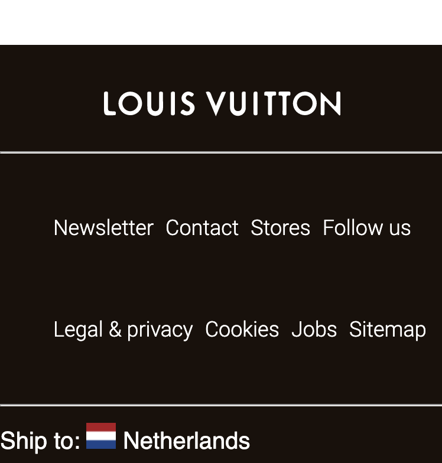
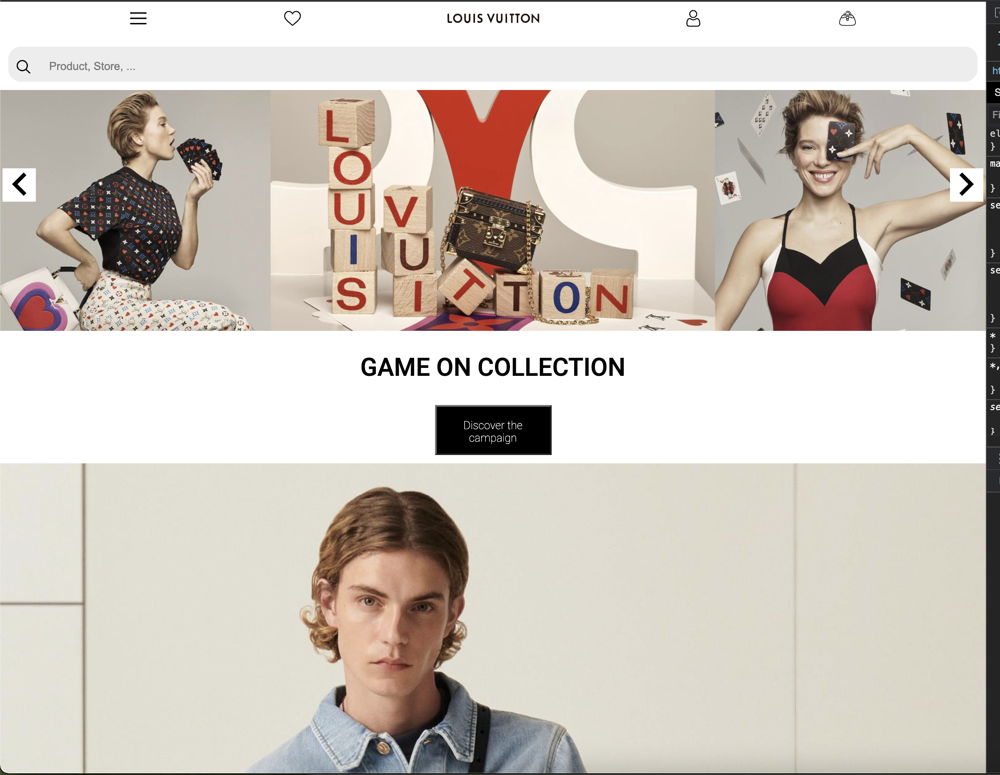
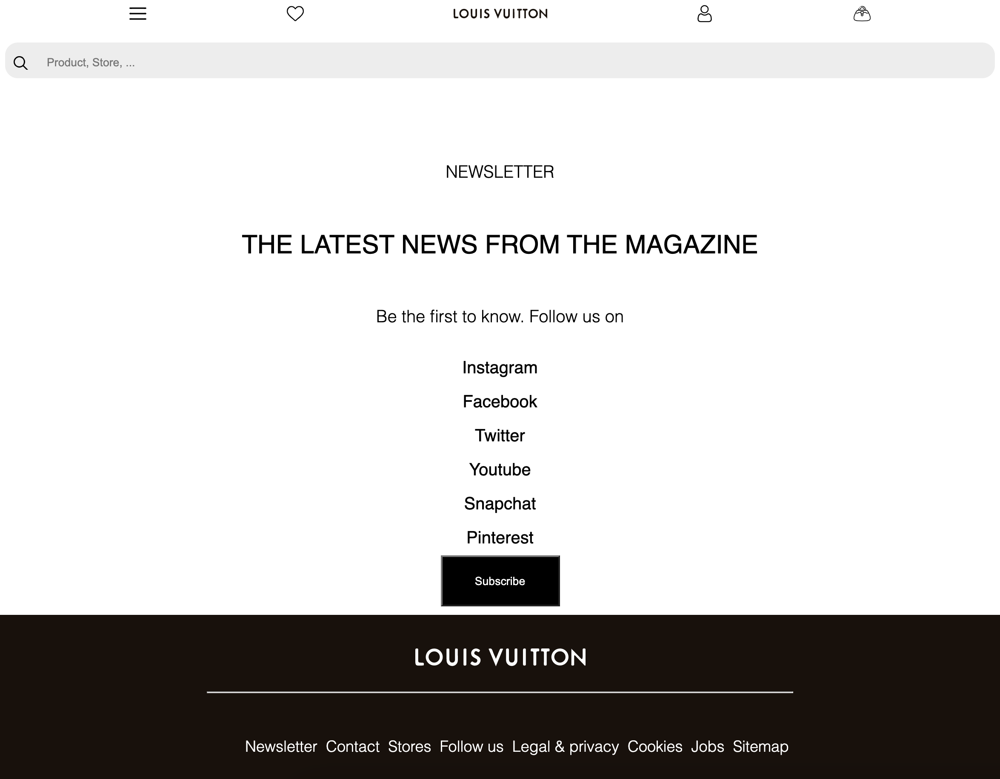
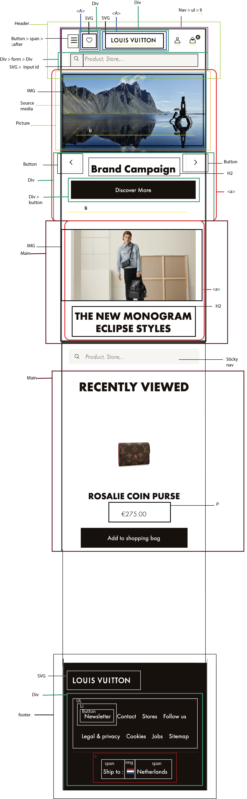
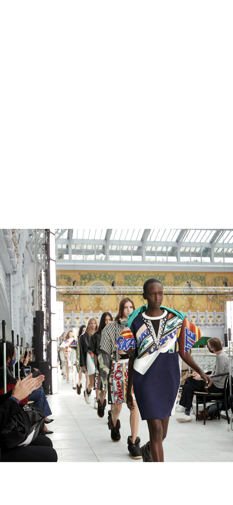

# Procesverslag
**Auteur:** -Chantal Valk-

Markdown cheat cheet: [Hulp bij het schrijven van Markdown](https://github.com/adam-p/markdown-here/wiki/Markdown-Cheatsheet). Nb. de standaardstructuur en de spartaanse opmaak zijn helemaal prima. Het gaat om de inhoud van je procesverslag. Besteedt de tijd voor pracht en praal aan je website.

## Bronnenlijst
1. -bron 1 Icons made by <a href="https://www.flaticon.com/authors/those-icons" title="Those Icons">Those Icons</a> from <a href="https://www.flaticon.com/" title="Flaticon"> www.flaticon.com</a> -
2. -bron 2 Icons made by <a href="http://www.freepik.com/" title="Freepik">Freepik</a> from <a href="https://www.flaticon.com/" title="Flaticon"> www.flaticon.com</a>-
3. -bron 3 https://www.w3schools.com/howto/howto_js_filter_dropdown.asp-
4. -bron 4 https://codeburst.io/how-to-create-horizontal-scrolling-containers-d8069651e9c6-
5. -bron 5 https://www.w3schools.com/howto/howto_js_collapsible.asp-
6. -bron 6 Iris van Ollefen-

## Eindgesprek (week 7/8)

-dit ging goed & dit was lastig-
Het lastigste vond ik om mijn focus en energie erbij te houden. Vooral nadat ik verder in het vak kwam en er steeds meer CSS kwam te staan op de pagina had ik het gevoel dat ik niets kon aanpassen zonder dat ik alle nth of types moest aanpassen.
Ik heb het dan ook erg tijdrovend gevonden om allemaal andere oplossingen te gebruiken dan classes toen ik heel specifiek ging werken aan bepaalde elementen.
Met elementen die steeds terugkomend zijn zoals een navigatie en een footer vond ik het wel veel fijner om niet met classes te werken omdat je gewoon weg sneller bent.
Verkeerd gebruik van classes is dan namelijk ook weer heel erg tijdrovend.
Verder heb ik wel geleerd dat ik in de toekomst meer tijd zou willen besteden aan het uitdenken van hoe ik mijn html het beste kan schrijven in verhouding tot mijn css.
Ik had nu in het begin heel veel images in articles gestopt zonder er eigenlijk bij stil te staan hoe ik wat zou plaatsen.
Mijn breakdownschets had ik dan ook liever ook voor widescreen gemaakt zodat ik daar misschien eerder tot ontdekking was gekomen hoe in mijn detail pagina bepaalde elementen in een rij van 2 of 3 staan.
Overall vond ik het een leuk vak alleen had ik graag meer tijd gehad om ook animaties te leren. Dit is dan weer niet de schuld van school maar meer hoe ik de laatste tijd in mijn vel zit.

**Screenshot(s):**

-screenshot(s) van je eindresultaat-

## Werken met screenrecorder

-Ik heb ontdekt tijdens het afspelen van beide webpaginas dat er echt nog wel veel ruimte is voor verbetering.
Bijvoorbeeld bij lijsten en knoppen, mijn gebruikers krijgen weinig informatie en de links worden erg snel afgespeeld.
Ook knoppen worden benoemd als Knop - Afbeelding - Knop. Hier moet ik zeker nog verandering in brengen om de website gebruiksvriendelijker te maken
voor mensen met een visuele handicap.
Naast dat de html dus aanpassingen nodig heeft moet ik ook iets bedeken voor de tekst. Louis vuitton gebruikt namelijk zowel Nederlands als Engels en Frans op hun website.
Ik merk dat de screenrecorder hier veel moeite mee heeft en daardoor de namen als onverstaanbaar uitspreekt voor de gebruiker.
Misschien kan ik ervoor kiezen om een gebruiksvriendelijke pagina te laden voor deze mensen met alles in het Nederlands.
Of kan ik aangeven aan de screenreader wanneer iets in franse taal is. Hierin moet ik mijzelf nog verder verdiepen.-

## Voortgang 3 (week 6)

-Ik heb bij voortgang 3 aangegeven in mijn gesprek met de leraar dat ik helaas erg weinig verder gekomen ben sinds voortgang 2.
Ik heb namelijk zeer veel last ervaren van mijn chronische depressie die nu zwaarder tot uiting komt in de winter en met coronatijd.
Dit zorgt ervoor dat ik elke dag minimaal wat aan mijn website heb kunnen doen omdat ik een zeer korte aandachtsspan heb en vooral veel bij slaap.
Ik heb wel een duidelijke planning voor mijzelf gemaakt in week 2 en hoop dat ik in de kerstvakantie genoeg afleiding en rust heb zodat mijn depressie weer meer naar de 
achtergrond kan verdwijnen.

mijn to do's blijven dus: Definitief de main en footer in orde maken. Daarna nog focus op de navigatiebar. 
Vervolgens de screenreader test uitvoeren en kijken of alle code semantisch correct is. En wanneer ik tijd over heb nog expirimenteren met animatie.-

## Voortgang 2 (week 5)

Het maken van een uitklapbaar menu was nog best gemakkelijk te doen, helaas was het vervolgens responsive maken van dit menu een veel grotere uitdaging.
Ook bleek de verschillende layout die op verschillende maten veranderd nog wel een klus te zijn. Nadat ik dit voor elkaar kreeg kwam ik eracht dat LV op hun eigen website ook van 1 navigatiebar naar 2 navigatiebars gaat.
Dit wordt opgebouwd vanuit de bestaande navigatie.
Uit de feedback kwam dat ik elementen niet dubbel mocht gebruiken dus ik moet het formulier nog aanpassen dat het 1 start locatie krijgt en daarna van plek wisselt.

Overall veel tijd kwijt geweest aan de oplossing met de @media's en het responsieve menu. Nu als tip gekregen om de focus te leggen bij de rest van de pagina's en daarna verder te gaan met het menu.
Voor aanstaande les helaas de belissing moeten maken om front-end helemaal opzij te zetten en te focussen op mijn andere vakken.

Alle verdere aanpassingen aan front-end uitgesteld naar de kerstvakantie.

To do's in kerstvakantie: definitief de main en footer helemaal in orde maken, daarna focussen op de navigatie bar, een semantische controle doen of alles correct is.
En als laatste een screenreader test uitvoeren. En als er tijd over is expirimenteren met animatie.

## Voortgang 1 (week 3)

### Stand van zaken

-dit ging goed & dit was lastig-

**Screenshot(s):**

De svg images hadden perongeluk allemaal nog een andere hoogte ondanks dat ik ze op maat gemaakt had in illustrator. Na tips van iris om een maximale hoogte mee te geven verdwenen mijn images niet meer. En kon ik verder. ik vond dit heel lastig om uit te zoeken om dat niet zozeer de pagina brak maar de images echt verdwenen.
Ook vond ik het lastig dat align content alleen pas gebruikt kan worden na flex-wrap:wrap. ik had dit na vragen en een toevallig oplettende blik op css-almanac wel begrepen.

Waar ik ook heel erg aan moest wennen was: hoe voller je containers zijn hoe meer je moet opletten waarop je de display flex gooit, en waar je je children styled.
Omdat ik in mijn html van article naar a ga en daarin de children zitten ging mijn hele flexbox niet af. Want de parent container is de link geworden. en niet de article. 
Ik merk dat deze logica voor mij echt vallen en opstaan is, door deze kleine foutjes voelt het alsof ik tegen dezelfde problemen aan blijf schoppen.
ik hoop dat dit met veel ervaring beter word.

Ook heb ik veel moeite gehad met het overstappen van classes op html, ik gebruikte wel html selectoren in mijn css maar dan altijd : main, img, p, .class. Hierdoor deed ik dus wat er van mij gevraagd werd wat was de html tags gebruiken in mijn css. maar ik heb dus blijkbaar nooit echt begrepen hoe het werkte.
Ik heb mijn verslag erop nageslagen en ik begrijp nu veel beter hoe het aanroepen in css werkt met html! en ik wil nooit meer terug naar classes! tenzij het voor 1 enkel element is misschien.
Overall heeft het mij ontzettend veel tijd bespaard doordat ik nu algemenere css kan schrijven.

Als laatste moet ik werken aan mijn zekerheid binnen programmeren, ik kwam erachter dat ik na de feedback al best heel ver ben maar ik voel mij nog wel erg onzeker in het programmeren zelf. Zoals kan ik wel genoeg voor een front-end stage etc.

Wat goed ging was de html schrijven, en mijn inzet om veel te leren van de opdrachten ernaast in codepen.

-screenshot(s) van hoe ver je bent met korte uitleg-

### Agenda voor meeting

-samen met je groepje opstellen-

| Anniek      | Chantal        | Gwyneth     | Mark       |
| ---            | ---            | ----        | ---              |
| de slider header  | Hoe krijg ik dit af in zo een korte tijd !  | De afbeeldingen in slider 2 op de gamepagina    | en dan ik dat    |
| de breedte van de afbeeldingen |   nog minstens 9 taken te voldoen tot 90%   | zoekbalk zonder streepje | dit wil ik zeker |
|  de footer die 2 coloms hoort          |        | list items in slider 1 niet mooi          | ...              |

### Verslag van meeting

-na afloop snel uitkomsten vastleggen-

## Breakdownschets (week 1)

-Breakdown schets uitgewerkt. main 1 deel de rest is herhaling.

## Intake (week 1)
-uitwerken voor de kick-off werkgroep - begin van de eerste week-

**Je startniveau:** -Rood-

**Je focus:** -Responsiveness-

- Na feedback gekozen voor een andere website:
Louis Vuitton https://en.louisvuitton.com/eng-nl/homepage

**Screenshot(s) van de eerste pagina (small screen):**

**Screenshot(s) van de tweede pagina (small screen):**

## na Intake (week 1)

